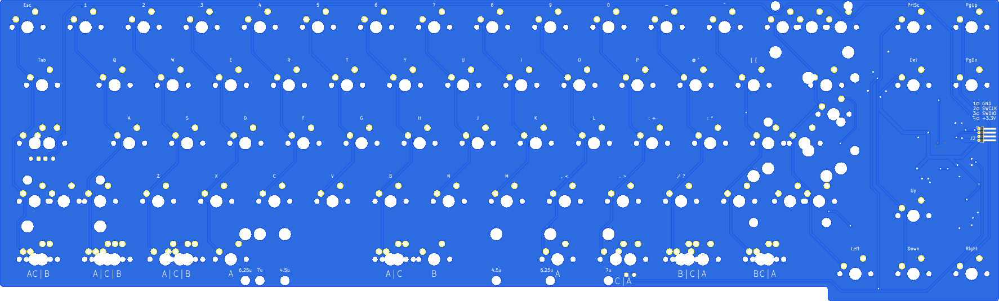
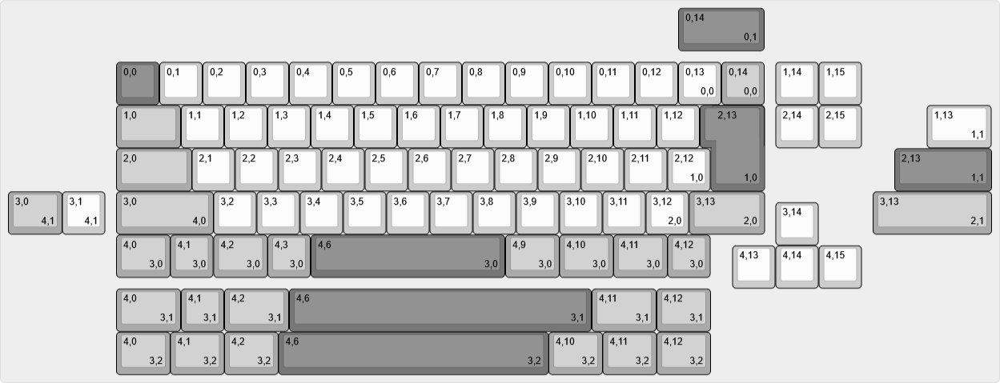

# Akihabara 65 v0.3

A 65% keyboard designed for JIS layout, with support for ANSI and ISO as well.

## Features

- Designed for STM32F072, but should be compatible with other STM32 models
- [Unified Daughterboard](https://github.com/ai03-2725/Unified-Daughterboard)
- QMK firmware; VIA support in progress
- PCB designed with KiCAD 6

## Layouts

## Known Issues

- Holes for stabilizers are excessively tight
- Right Shift and ANSI Enter stabilizers cannot be used simultaneously
- SWD header pin pitch should be increased for ease of use