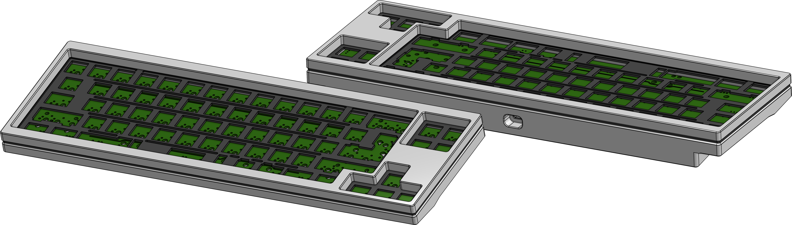
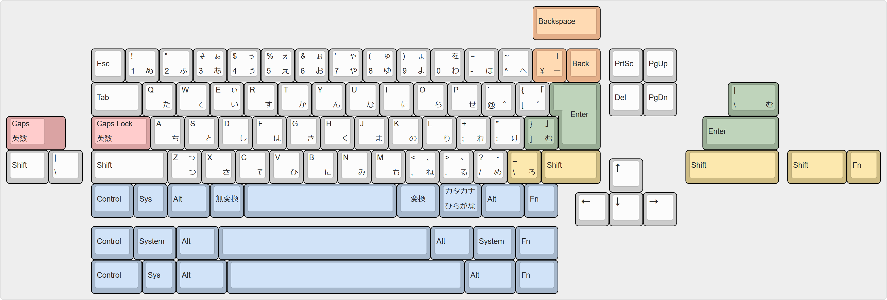

# Akihabara 65 v0.4

### A 65% keyboard designed for JIS layout, with ANSI and ISO support.

## Design Overview & Features

### Case

- 7° typing angle
- Modified sandwich mount
- [Effective Keyboard Height](https://github.com/Croktopus/effective-keyboard-height): 21.9 mm
- [SKUF](https://github.com/Zambumon/SKUF) Feet
- Approximately 1050 g with aluminium plate
- Exposed plate edges
- Plate features four rows of flex cuts and four "mounting points" in an attempt to soften the harshness associated with sandwich mount
- 9.525 mm top and bottom bezels, 4.7625 mm side bezels
- 339 x 116 x 31 mm

### PCB

- Designed for STM32F072, but should be compatible with other STM32 models
- [Unified C3](https://github.com/ai03-2725/Unified-Daughterboard) Daughterboard
- QMK & VIA in progress
- PCB designed with KiCAD 6
- Bottom row legend; no more guessing where to place your switches and stabilizers
- Two flex cuts

## Layouts

The Akihabara 65 was designed for a JIS layout with a 4.5u spacebar, but it supports many layouts. Options include:

- Standard or Stepped Caps Lock
- Standard or Split Backspace
- 2.75u or Split Right Shift (1.75u | 1u **OR** 1u | 1.75u)
- ANSI or ISO/JIS Enter
- 4.5u, 6.25u, or 7u Bottom Row

## Supported Keycap Sets

Almost all sets will support ANSI, and many support ISO as well, however JIS is significantly less common amongst custom keyboard enthusiasts, even in Japan. Still, keycap sets with JIS compatibility do exist. Known sets include:

- [ePBT SimpleJA R2](https://geekhack.org/index.php?topic=114422.0)[^kitting][^spacebar] by ai03
- [ePBT ModernJA](https://geekhack.org/index.php?topic=109341.0)[^kitting][^spacebar] by ai03
- [TMT Story](https://geekhack.org/index.php?topic=112681.0)[^gb] by shawnlyx/lunasho
- [GMK JIS](https://geekhack.org/index.php?topic=108328.0)[^gb] by 2Moons
- [Majestouch Keycaps](https://www.diatec.co.jp/products/list.php?s[]=100:1002:10008)[^fn] by FILCO/DIATEC

[^kitting]: Requires JIS/ISO kit
[^spacebar]: Does not include 4.5u spacebar
[^gb]: Group buy not yet fulfilled
[^fn]: Does not inclue R4 1u Fn key; can substitute with Menu key

### 4.5u Keycaps & Stabilizers

Outside of Japan, 4.5u spacebars are very uncommon; even more so in the quality we expect in this hobby. The selection is very limited, but not completely nonexistent.

The easiest way to acquire a 4.5u spacebar is to purchase one from KPRepublic [here](https://kprepublic.com/products/xda-blank-convex-spacebar-grey-1-75u-2u-2-25u-2-75u-3u-4-5u-5-5u-6u-6-25u-6-5u-7u-blank-keycaps-for-xd60-xd64-xd84-xd75-gh60-60). Unfortunately, these only come in grey PBT in XDA profile. An XDA spacebar does not look too out of place amongst Cherry-profile keycaps, and being PBT you can theoretically dye it. Signature Plastics also produces 4.5u spacebars in their SA profile, but these are unfortunately not sold on PMK, so acquiring one might prove difficult. TomatoCaps has a 4.5u spacebar mold, as seen in TMT Story. GMK will also have a 4.5u spacebar mold some time in 2022.

The only place I have found that sells 4.5u stabilizers is NPKC RGB CP Store on AliExpress. I purchased mine from their store [here](https://www.aliexpress.com/item/32855603554.html); just leave the seller a message on checkout saying you want 4.5u wires instead of 6.25u. I believe they will also sell you the wires by themselves; the housings are not very good at all, so this route may be preferable.

You can also make a 4.5u wire yourself by cutting and bending a 6.25u or 7u wire (or any wire longer than 4.5u). The centre-to-centre distance of the stabilizer mounts on a 4.5u spacebar is 69.342 mm. It is difficult to get the bend radius tight without a wire bender, but that still did not cause any issues with the Durock wire I bent.

## And A Big "Thank You" To:

- **kkatano** for the [Bakeneko](https://github.com/kkatano/bakeneko-65), from which I took many design elements for the case (and it's also just a really nice keyboard)
- **4pplet** and **Gondolindrim** for sharing their knowledge of ARM-powered keyboards in a world filled with AVR
- **ai03** for their brilliant [plate generator](https://kbplate.ai03.com/) and [keyswitch footprints](https://github.com/ai03-2725/MX_Alps_Hybrid), as well as their [PCB design guide](https://wiki.ai03.com/books/pcb-design)
- **hadi** for their [PCB design series](https://www.youtube.com/watch?v=BhFqkVggv8Q), unfinished as it may be
- **2Moons** for helping me confirm dimensions for 4.5u spacebars 
