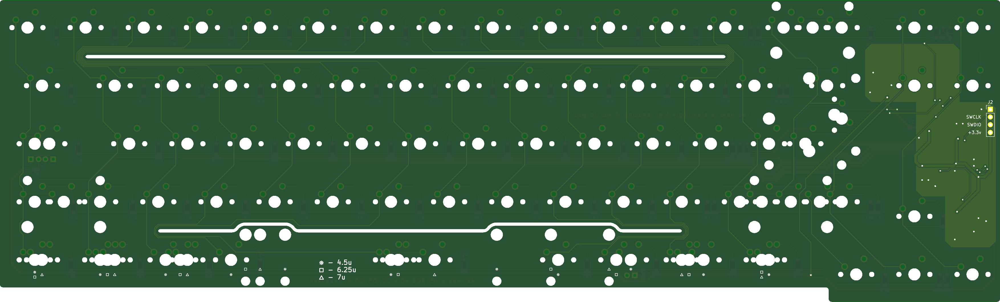
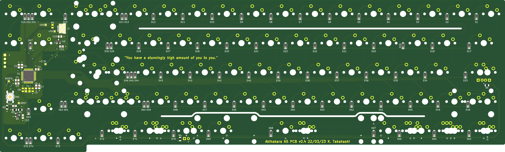

# Akihabara 65 v0.4

A 65% keyboard designed for JIS layout, with support for ANSI and ISO as well.

## Features

- Designed for STM32F072, but should be compatible with other STM32 models
- [Unified Daughterboard](https://github.com/ai03-2725/Unified-Daughterboard)
- QMK & VIA in progress
- PCB designed with KiCAD 6

## Layouts

The Akihabara 65 was designed for a JIS layout with a 4.5u spacebar, but it supports many layouts. Options include:

- Standard or Stepped Caps Lock
- Standard or Split Backspace
- 2.75u or Split Right Shift (1.75u | 1u **OR** 1u | 1.75u)
- ANSI or ISO/JIS Enter
- 4.5u, 6.25u, or 7u Bottom Row

